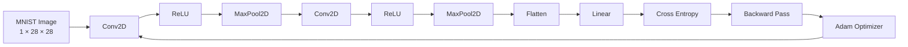
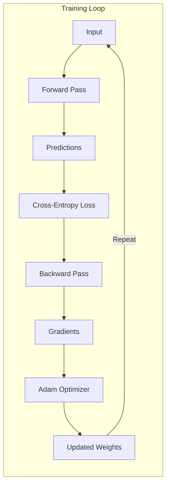
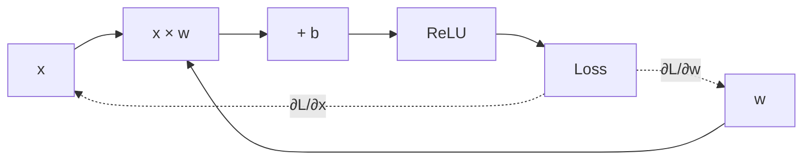
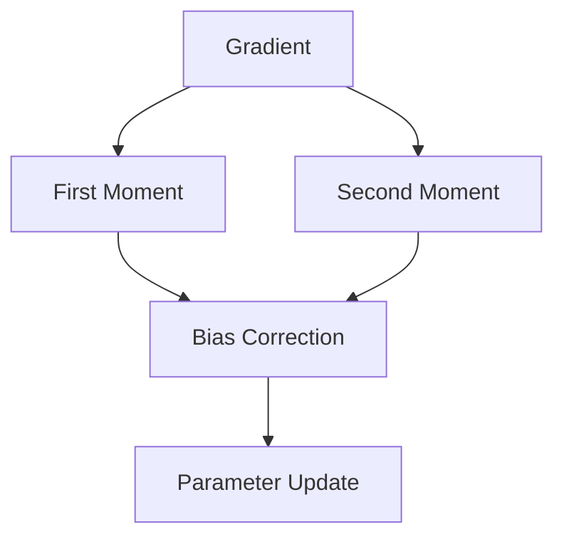
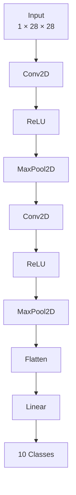
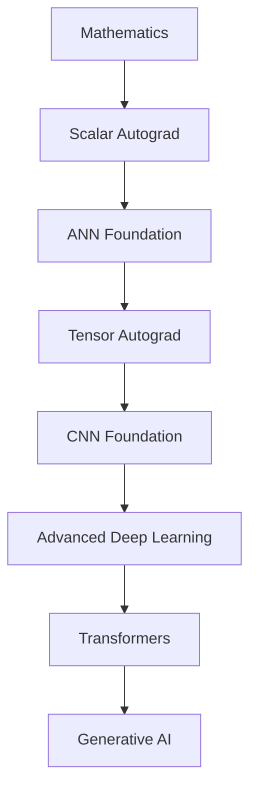

# CNN Foundation

> A minimal Convolutional Neural Network framework built from scratch in pure Python and NumPy — including tensor autograd, convolution, pooling, backpropagation, cross-entropy loss, Adam optimization, and MNIST training.

[](https://www.python.org/)
[](https://numpy.org/)
[](LICENSE)

---

## Overview

**CNN Foundation** is a convolutional neural network framework implemented from first principles using Python and NumPy.

The project is designed to answer a fundamental question:

> **What is actually happening inside a CNN during forward propagation, backpropagation, and optimization?**

Instead of relying on PyTorch, TensorFlow, or another deep-learning framework, the core components are implemented manually:

```text
Tensor
  │
  ▼
Computation Graph
  │
  ├── Forward Pass
  │
  └── Backward Pass
          │
          ▼
       Gradients
          │
          ▼
     Adam Optimizer
          │
          ▼
    Updated Parameters
```

The project extends the ideas developed in the [ANN Foundation](https://github.com/rahulkp-ai/ann-foundation) project from **scalar automatic differentiation** to **tensor-based deep learning**.

---

## Learning Objective

The purpose of this project is **not** to build a production-ready replacement for PyTorch.

The purpose is to understand the internal mechanics of modern deep-learning frameworks by implementing them ourselves.

The learning progression is:

```text
Scalar Autograd
      │
      ▼
Tensor Autograd
      │
      ▼
Neural Network Layers
      │
      ▼
Convolution
      │
      ▼
Pooling
      │
      ▼
Loss Functions
      │
      ▼
Backpropagation
      │
      ▼
Adam Optimization
      │
      ▼
CNN Training
      │
      ▼
MNIST Classification
```

---

# Architecture

The complete CNN training pipeline is:



The same parameters are updated repeatedly:



---

# Core Components

## 1. Tensor Autograd Engine

`src/engine.py`

The autograd engine provides the fundamental tensor abstraction used by the rest of the framework.

Each tensor stores:

- numerical data
- gradient
- parent tensors
- operation metadata
- backward function

Conceptually:

```text
Tensor
├── data
├── grad
├── _prev
└── _backward
```

During the forward pass, operations construct a computation graph.

During the backward pass, the graph is traversed in reverse topological order.



This provides the foundation for implementing neural-network backpropagation without an external autograd library.

---

# 2. Convolution

`src/layers.py`

The convolution layer implements the core operation used by CNNs.

For an input tensor:

$$X \in \mathbb{R}^{N \times C \times H \times W}$$

and convolution kernel:

$$W \in \mathbb{R}^{C_{out} \times C_{in} \times K_h \times K_w}$$

the convolution produces:

$$Y \in \mathbb{R}^{N \times C_{out} \times H_{out} \times W_{out}}$$

The implementation uses the **im2col** transformation to convert local image patches into a matrix representation.

```text
Input Image
    │
    ▼
┌─────────────┐
│  Local      │
│  Patches    │
└─────────────┘
    │
    ▼
  im2col
    │
    ▼
┌─────────────────┐
│ Patch Matrix    │
└─────────────────┘
    │
    │ Matrix Multiplication
    ▼
┌─────────────────┐
│ Convolution     │
│ Output          │
└─────────────────┘
```

More details are documented in:

`docs/Understanding im2col.md`

---

# 3. ReLU Activation Function

`src/activations.py`

The Rectified Linear Unit is:

$$\text{ReLU}(x) = \max(0, x)$$

Its derivative is:

$$\frac{d}{dx}\text{ReLU}(x) = \begin{cases} 1 & x > 0 \\ 0 & x < 0 \end{cases}$$

ReLU introduces non-linearity into the network and allows the CNN to learn complex representations.

---

# 4. Max Pooling

`src/layers.py`

Max pooling reduces spatial dimensions while retaining strong local activations.

For a (2\times2) pooling window:

```text
┌─────┬─────┐
│  1  │  5  │
├─────┼─────┤
│  2  │  3  │
└─────┴─────┘

        ↓

       5
```

During backpropagation, the gradient is routed to the element that produced the maximum value.

```text
Forward:

[ 1  5 ]
[ 2  3 ]  →  5


Backward:

[ 0  ∂L/∂y ]
[ 0     0  ]
```

---

# 5. Flatten

After convolution and pooling, the feature maps are converted from a spatial tensor into a vector.

For example:

```text
Feature Maps

Channels × Height × Width
          │
          ▼
      Flatten
          │
          ▼
       Vector
          │
          ▼
      Linear Layer
```

This allows the extracted convolutional features to be passed into the final classifier.

---

# 6. Linear Layer

`src/layers.py`

The linear layer performs:

$$y = Wx + b$$

where:

- (W) is the weight matrix
- (x) is the input
- (b) is the bias
- (y) is the output

The final linear layer produces one logit per MNIST class:

```text
Feature Vector
      │
      ▼
Linear Layer
      │
      ▼
10 Logits
      │
      ├── Digit 0
      ├── Digit 1
      ├── Digit 2
      ├── ...
      └── Digit 9
```

---

# 7. Cross-Entropy Loss

`src/losses.py`

For multi-class classification, the project uses cross-entropy loss.

Given logits:

$$
z_1,z_2,\ldots,z_C
$$

softmax converts them into probabilities:

$$
P(y=i)=
\frac{e^{z_i}}
{\sum_j e^{z_j}}
$$

The cross-entropy loss for the correct class (y) is:

$$
L=-\log P(y)
$$

The loss therefore measures how confidently the model predicts the correct class.

```text
Logits
  │
  ▼
Softmax
  │
  ▼
Class Probabilities
  │
  ▼
Correct Label
  │
  ▼
Cross Entropy
```

Detailed notes:

`docs/Cross-Entropy and Adam.md`

---

# 8. Adam Optimizer

`src/optim.py`

The project implements the **Adam (Adaptive Moment Estimation)** optimizer.

Adam maintains two exponential moving averages:

### First moment

$$
m*t=\beta_1m*{t-1}+(1-\beta_1)g_t
$$

### Second moment

$$
v*t=\beta_2v*{t-1}+(1-\beta_2)g_t^2
$$

Bias correction is then applied:

$$
\hat m_t=
\frac{m_t}{1-\beta_1^t}
$$

$$
\hat v_t=
\frac{v_t}{1-\beta_2^t}
$$

The parameter update becomes:

$$
\theta*t=
\theta*{t-1}
$$

$$
\alpha
\frac{\hat m_t}
{\sqrt{\hat v_t}+\epsilon}
$$

Conceptually:



---

# CNN Architecture

The current network follows the classic small-CNN pattern:



This architecture demonstrates the fundamental division of responsibilities in a CNN:

```text
Convolution
    ↓
Feature Extraction
    ↓
Pooling
    ↓
Spatial Compression
    ↓
Flatten
    ↓
Classification
```

The reasoning behind this architecture is documented in:

`docs/CNN architecture pattern.md`

---

# Why This Pipeline?

The architecture:

```text
Conv2D
→ ReLU
→ MaxPool2D
→ Conv2D
→ ReLU
→ MaxPool2D
→ Flatten
→ Linear
```

is not arbitrary.

Each stage solves a different problem.

| Component | Purpose                            |
| --------- | ---------------------------------- |
| Conv2D    | Learn spatial features             |
| ReLU      | Introduce non-linearity            |
| MaxPool2D | Reduce spatial dimensions          |
| Conv2D    | Learn higher-level features        |
| ReLU      | Introduce additional non-linearity |
| MaxPool2D | Further compress representations   |
| Flatten   | Convert feature maps to vector     |
| Linear    | Perform final classification       |

The first convolution can learn relatively simple patterns such as:

```text
Edges → Corners → Simple textures
```

Later convolutional layers can combine those representations:

```text
Edges
  ↓
Curves
  ↓
Digit components
  ↓
Digit identity
```

---

# `im2col`

One of the main implementation concepts in this project is `im2col`.

`im2col` does **not** perform convolution itself.

Instead, it rearranges local image patches into columns so convolution can be expressed using matrix multiplication.

For example:

```text
Input

┌───┬───┬───┬───┐
│ 0 │ 1 │ 2 │ 3 │
├───┼───┼───┼───┤
│ 4 │ 5 │ 6 │ 7 │
├───┼───┼───┼───┤
│ 8 │ 9 │10 │11 │
├───┼───┼───┼───┤
│12 │13 │14 │15 │
└───┴───┴───┴───┘
```

A (3\times3) sliding window produces:

```text
Patch 1          Patch 2
0  1  2          1  2  3
4  5  6          5  6  7
8  9 10          9 10 11
```

These patches are flattened and arranged into a matrix.

```text
┌──────────────┐
│ Patch 1      │
│ Patch 2      │
│ Patch 3      │
│ ...          │
└──────────────┘
```

Convolution can then be computed efficiently using matrix multiplication.

Detailed derivation:

`docs/Understanding im2col.md`

---

# Backpropagation

The backward pass applies the chain rule through the entire CNN.

For example:

```text
Loss
 │
 ▼
Linear
 │
 ▼
Flatten
 │
 ▼
MaxPool
 │
 ▼
ReLU
 │
 ▼
Conv2D
 │
 ▼
MaxPool
 │
 ▼
ReLU
 │
 ▼
Conv2D
 │
 ▼
Input
```

Each operation receives an upstream gradient and computes the gradients required by its inputs and parameters.

Mathematically:

$$
\frac{\partial L}{\partial x}

\frac{\partial L}{\partial y}
\frac{\partial y}{\partial x}
$$

Repeated application of this rule allows the final loss to influence every trainable parameter in the network.

---

# Tensor Autograd

The project extends scalar autograd into tensor-based automatic differentiation.

The conceptual difference is:

```text
ANN Foundation

Value
 │
 ▼
Scalar computation
 │
 ▼
Scalar gradient
```

versus:

```text
CNN Foundation

Tensor
 │
 ▼
Tensor computation
 │
 ▼
Tensor gradient
 │
 ▼
CNN parameters
```

This is the key transition from a minimal MLP engine to a deep-learning framework capable of implementing convolutional networks.

Detailed documentation:

`docs/Tensor Autograd.md`

---

# MNIST

The project uses the **MNIST handwritten-digit dataset**.

Each sample is:

```text
28 × 28 grayscale image
```

with one of ten labels:

```text
0 1 2 3 4 5 6 7 8 9
```

Example:

```text
┌─────────────────────┐
│                     │
│       ███           │
│      █   █          │
│          █          │
│         █           │
│        █            │
│       █             │
│      ███████        │
│                     │
└─────────────────────┘

        Digit: 7
```

The dataset files are stored under:

```text
examples/mnist_data/
```

---

# Training

The training script is:

```text
train_and_save.py
```

The general training process is:

```python
for epoch in range(epochs):

    # Forward pass
   logits = model(images)

    # Compute loss
   loss = cross_entropy(logits, labels)

    # Backward pass
   loss.backward()

    # Update parameters
   optimizer.step()

    # Clear gradients
   optimizer.zero_grad()
```

Conceptually:

$$
\boxed{
\text{Forward}
\rightarrow
\text{Loss}
\rightarrow
\text{Backward}
\rightarrow
\text{Adam}
\rightarrow
\text{Repeat}
}
$$

---

# Saved Model

Trained parameters can be stored in:

```text
model_weights.npz
```

NumPy's `.npz` format allows the learned parameters to be saved without depending on a deep-learning framework.

The model can therefore be separated into:

```text
Architecture
+
Learned Parameters
=
Trained CNN
```

---

# Project Structure

```text
cnn-foundation/
│
├── app.py
│
├── src/
│   ├── __init__.py
│   ├── engine.py
│   ├── activations.py
│   ├── layers.py
│   ├── losses.py
│   ├── model.py
│   ├── optim.py
│   └── utils.py
│
├── tests/
│   ├── __init__.py
│   ├── test_engine.py
│   ├── test_layers.py
│   └── test_optim.py
│
├── docs/
│   ├── CNN architecture pattern.md
│   ├── Cross-Entropy and Adam.md
│   ├── Neural Network Layers.md
│   ├── Tensor Autograd.md
│   └── Understanding im2col.md
│
├── notebooks/
│   └── Tensor-Autograd.ipynb
│
├── examples/
│   ├── mnist_data/
│   │   ├── t10k-images-idx3-ubyte.gz
│   │   ├── t10k-labels-idx1-ubyte.gz
│   │   ├── train-images-idx3-ubyte.gz
│   │   └── train-labels-idx1-ubyte.gz
│   │
│   ├── MNIST-Training-Visualization.ipynb
│   ├── sample_0.png
│   ├── sample_1.png
│   └── sample_7.png
│
├── model_weights.npz
├── train_and_save.py
├── app.py
├── pyproject.toml
├── setup.py
├── requirements.txt
├── LICENSE
└── README.md
```

---

# Installation

Clone the repository:

```bash
git clone https://github.com/rahulkp-ai/cnn-foundation.git
cd cnn-foundation
```

Create a virtual environment:

```bash
python3 -m venv .venv
source .venv/bin/activate
```

Install dependencies:

```bash
pip install -r requirements.txt
```

For editable installation:

```bash
pip install -e .
```

---

# Training the CNN

Run:

```bash
python train_and_save.py
```

The training process performs:

```text
Load MNIST
   ↓
Preprocess images
   ↓
Create CNN
   ↓
Forward propagation
   ↓
Cross-entropy loss
   ↓
Backward propagation
   ↓
Adam update
   ↓
Save weights
```

The resulting parameters are stored in:

```text
model_weights.npz
```

---

# Running the Demo

The project includes an application entry point:

```bash
python app.py
```

The application provides an interactive interface for experimenting with the trained CNN.

---

# Running Tests

Run the test suite with:

```bash
pytest tests/ -v
```

The tests cover the core components of the framework:

```text
tests/
├── test_engine.py
├── test_layers.py
└── test_optim.py
```

The testing strategy focuses on verifying that individual mathematical operations produce correct forward and backward behaviour.

---

# Documentation

The `docs/` directory contains detailed first-principles explanations of the major concepts implemented in this repository.

### CNN Architecture Pattern

Explains why the common CNN pipeline is:

```text
Conv2D
→ ReLU
→ MaxPool2D
→ Conv2D
→ ReLU
→ MaxPool2D
→ Flatten
→ Linear
```

### Neural Network Layers

Explains the responsibilities and mathematical behaviour of:

- Conv2D
- ReLU
- MaxPool2D
- Flatten
- Linear

### Tensor Autograd

Explains how automatic differentiation extends from scalar values to tensors.

### Understanding `im2col`

Derives the transformation used to implement convolution using matrix multiplication.

### Cross-Entropy and Adam

Explains:

- logits
- softmax
- cross-entropy
- gradients
- Adam
- first and second moments
- bias correction
- parameter updates

---

# Learning Path

This project is part of a progression toward understanding modern deep-learning systems from first principles.



The progression can be summarized as:

```text
ANN Foundation
     │
     │ scalar computation
     ▼
Tensor Autograd
     │
     │ multidimensional computation
     ▼
CNN Foundation
     │
     │ spatial feature learning
     ▼
Deep Learning Architectures
     │
     ▼
Transformers
     │
     ▼
Generative AI
```

---

# Relationship to ANN Foundation

CNN Foundation builds directly on the concepts developed in:

**ANN Foundation**

```text
ANN Foundation
────────────────────────────
Scalar Value
Computation Graph
Reverse Autograd
Chain Rule
Neuron
Layer
MLP
Gradient Descent
```

which evolve into:

```text
CNN Foundation
────────────────────────────
Tensor
Tensor Computation Graph
Reverse Autograd
Chain Rule
Conv2D
ReLU
MaxPool2D
Flatten
Linear
Cross Entropy
Adam
CNN
```

The central idea remains the same:

$$
\boxed{\text{Build the abstraction yourself to understand the abstraction.}}
$$

---

# Design Philosophy

## No Deep-Learning Framework

The core implementation intentionally avoids:

```text
PyTorch
TensorFlow
Keras
JAX
```

<b>The goal is mathematical transparency rather than production performance.</b>

---

## NumPy as the Numerical Foundation

NumPy provides:

- multidimensional arrays
- matrix multiplication
- numerical operations
- efficient low-level array computation

The neural-network logic itself is implemented by this project.

---

## Explicit Backpropagation

Instead of hiding gradient computation behind a framework API, the implementation exposes the mechanics:

```text
Operation
   │
   ▼
Forward computation
   │
   ▼
Store graph information
   │
   ▼
Backward computation
   │
   ▼
Accumulate gradients
```

This makes the implementation easier to inspect and reason about.

---

# Limitations

This project is intentionally educational and therefore has several limitations.

### Performance

The implementation is significantly slower than optimized frameworks such as PyTorch.

### CPU Only

The project does not provide GPU acceleration.

### Limited Tensor Operations

Only the tensor operations required by the current CNN implementation are implemented.

### No Production-Scale Training

The framework is designed for learning and experimentation rather than large-scale model training.

### Limited Architecture Support

The current implementation focuses on a compact CNN architecture rather than providing a general-purpose neural-network API.

These limitations are intentional.

> **The priority is understanding the mechanism, not maximizing throughput.**

---

# What This Project Demonstrates

By completing this project, the following concepts are implemented rather than merely used:

- Tensor computation
- Automatic differentiation
- Computation graphs
- Reverse-mode autodiff
- Chain rule
- Gradient accumulation
- Convolution
- `im2col`
- ReLU
- Max pooling
- Flattening
- Linear layers
- Softmax
- Cross-entropy
- Backpropagation
- Adam optimization
- CNN training
- MNIST classification
- Model serialization
- Numerical testing

---

# From Equations to Code

The project follows a deliberate mapping between mathematical concepts and implementation.

| Mathematics                     | Implementation               |
| ------------------------------- | ---------------------------- |
| (y=x+w)                         | Tensor operator              |
| (\frac{\partial L}{\partial x}) | `grad`                       |
| Chain rule                      | `_backward()`                |
| Convolution                     | `Conv2D`                     |
| (ReLU(x))                       | `ReLU`                       |
| (\max(x))                       | `MaxPool2D`                  |
| (Wx+b)                          | `Linear`                     |
| Softmax                         | Cross-entropy implementation |
| (-\log p_y)                     | Classification loss          |
| (m_t)                           | Adam first moment            |
| (v_t)                           | Adam second moment           |
| (\theta\_{t+1})                 | Optimizer update             |

This is the central educational objective of the repository:

```text
Equation
  ↓
Algorithm
  ↓
Python / NumPy
  ↓
Neural Network
  ↓
Trained Model
```

---

# Future Extensions

Potential future directions include:

- [ ] Batch normalization
- [ ] Dropout
- [ ] Additional convolution configurations
- [ ] Padding and stride experimentation
- [ ] More tensor broadcasting operations
- [ ] Better numerical gradient checking
- [ ] Learning-rate schedulers
- [ ] SGD with momentum
- [ ] More CNN architectures
- [ ] CIFAR-10 support
- [ ] Model checkpointing
- [ ] Training metrics dashboard
- [ ] GPU backend experimentation
- [ ] ONNX-style model representation

---

# License

This project is licensed under the MIT License.

See [LICENSE](LICENSE) for details.

---

# Author

**RAHUL K P**

MSc Computer Science — University of Calicut

AI/ML Engineering · Deep Learning · Generative AI

- GitHub: [@rahulkp-ai](https://github.com/rahulkp-ai)
- LinkedIn: [rahulkp-ai](https://linkedin.com/in/rahulkp-ai)
- Kaggle: [rahulkpai](https://kaggle.com/rahulkpai)

---

## Philosophy

> **Don't just use deep-learning frameworks. Understand what they are doing.**

CNN Foundation is an attempt to peel back the abstractions behind modern deep learning and reconstruct the essential mechanisms step by step:

```text
Tensor
 ↓
Autograd
 ↓
Convolution
 ↓
Backpropagation
 ↓
Optimization
 ↓
Learning
```

From a matrix operation to a trained neural network — **built from the mathematical foundations upward.**
