# `layers.py` — Stateful CNN Layers

> **Purpose:** This note explains every class, method, parameter, tensor shape, initialization rule, and data flow implemented in `src/layers.py`.

---

## 1. What is `layers.py`?

`layers.py` defines the **stateful layers** of the CNN foundation project.

The functional operations live in `engine.py`:

- `conv2d()`
- `max_pool2d()`
- tensor matrix multiplication
- tensor reshape/autograd operations

`layers.py` wraps those operations into reusable objects that can **store learnable parameters**.

The main layers are:

| Layer       | Purpose                                            | Learnable parameters? |
| ----------- | -------------------------------------------------- | --------------------: |
| `Conv2D`    | Extract spatial features using convolution filters |                   Yes |
| `MaxPool2D` | Downsample feature maps                            |                    No |
| `Linear`    | Perform fully connected transformation             |                   Yes |
| `Flatten`   | Convert feature maps into vectors                  |                    No |

### High-level architecture

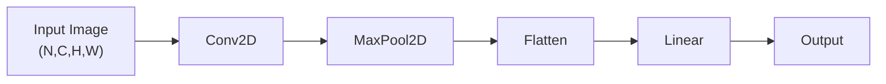

---

# 2. Functional vs Stateful Design

A useful way to understand `layers.py` is to separate **operations** from **layers**.

## Functional operation

A functional operation performs computation directly:

```python
out = conv2d(x, weight, bias)
```

The function itself does not necessarily represent a complete reusable model component.

## Stateful layer

A stateful layer stores parameters internally:

```python
layer = Conv2D(1, 8, 3)
out = layer(x)
```

The `Conv2D` object owns:

```text
weight
bias
stride
pad
```

### Relationship

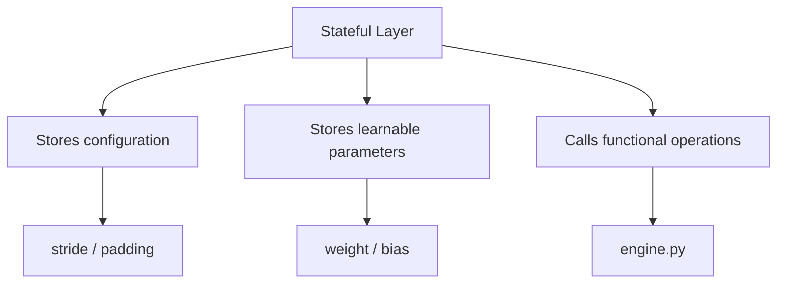

This is similar to the design used by deep-learning frameworks such as PyTorch.

---

# 3. Base `Layer` Class

```python
class Layer:
    """Base class — just defines the shared interface."""
```

`Layer` provides a common interface for all layers.

It defines three important behaviors:

```python
parameters()
zero_grad()
__call__(x)
```

---

## 3.1 `parameters()`

```python
def parameters(self):
    return []
```

The base implementation returns an empty list.

A layer overrides this method when it contains learnable parameters.

### Example

`Conv2D`:

```python
def parameters(self):
    return [self.weight] + ([self.bias] if self.bias is not None else [])
```

`MaxPool2D`:

```python
def parameters(self):
    return []
```

### Why is this important?

The optimizer needs to know **which tensors should be updated**.

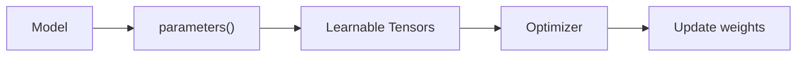

---

# 4. `zero_grad()`

```python
def zero_grad(self):
    for p in self.parameters():
        p.zero_grad()
```

This resets the gradients of all learnable parameters.

During training:

```text
forward
   ↓
loss
   ↓
backward
   ↓
gradients
   ↓
optimizer update
```

Before the next backward pass, gradients must normally be cleared.

### Training loop concept

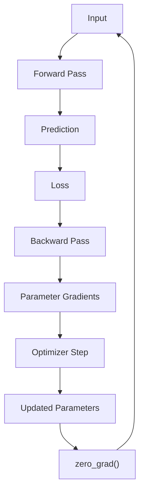

---

# 5. `__call__(x)`

The base class defines:

```python
def __call__(self, x):
    raise NotImplementedError
```

Each concrete layer implements its own forward pass.

This allows the intuitive syntax:

```python
output = layer(input)
```

instead of:

```python
output = layer.forward(input)
```

The project therefore treats layers like callable functions.

---

# 6. `Conv2D`

## Purpose

`Conv2D` performs a **2D convolution**.

It is primarily used to extract spatial features from images.

Typical progression:

```text
pixels
  ↓
edges
  ↓
textures
  ↓
shapes
  ↓
higher-level patterns
```

---

## 6.1 Constructor

```python
def __init__(
    self,
    in_channels,
    out_channels,
    kernel_size,
    stride=1,
    pad=0,
    bias=True
):
```

### Parameters

| Parameter      | Meaning                                          |
| -------------- | ------------------------------------------------ |
| `in_channels`  | Number of channels entering the layer            |
| `out_channels` | Number of filters/features produced              |
| `kernel_size`  | Spatial size of each square filter               |
| `stride`       | Number of pixels the filter moves                |
| `pad`          | Zero-padding added around the input              |
| `bias`         | Whether each output channel has a learnable bias |

---

# 7. Conv2D Tensor Shapes

The input follows the common NCHW convention:

```text
(N, C, H, W)
```

Where:

- `N` = batch size
- `C` = channels
- `H` = height
- `W` = width

For example:

```text
(32, 3, 64, 64)
```

means:

```text
32 images
3 channels
64 pixels high
64 pixels wide
```

---

## Weight shape

The convolution weight has shape:

```text
(out_channels,
 in_channels,
 kernel_size,
 kernel_size)
```

For:

```python
Conv2D(
    in_channels=3,
    out_channels=16,
    kernel_size=3
)
```

the weight shape is:

```text
(16, 3, 3, 3)
```

That means the layer contains:

```text
16 filters
×
3 input channels
×
3 × 3 spatial kernel
```

### Visualization

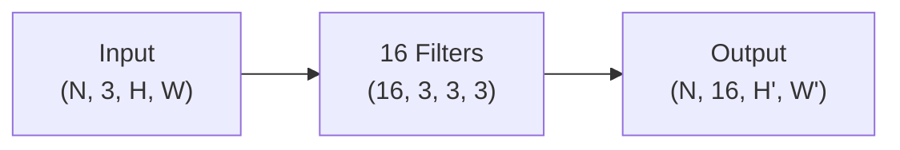

Each filter produces one output feature map.

Therefore:

```text
number of filters = number of output channels
```

---

# 8. What Does a Convolution Filter Do?

A `3 × 3` filter slides over the image.

Conceptually:

```text
Input:

[ a b c d ]
[ e f g h ]
[ i j k l ]
[ m n o p ]

Kernel:

[ w1 w2 w3 ]
[ w4 w5 w6 ]
[ w7 w8 w9 ]
```

The kernel multiplies corresponding values and sums them.

```text
output =
a*w1 + b*w2 + c*w3
+ e*w4 + f*w5 + g*w6
+ i*w7 + j*w8 + k*w9
```

The filter then moves across the image.

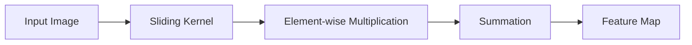

Different filters can learn different visual patterns.

---

# 9. `Conv2D` Weight Initialization

The implementation computes:

```python
fan_in = in_channels * kernel_size * kernel_size
```

For example:

```text
in_channels = 3
kernel_size = 3

fan_in = 3 × 3 × 3
       = 27
```

Then:

```python
limit = np.sqrt(
    6.0 / (
        fan_in +
        out_channels * kernel_size * kernel_size
    )
)
```

Weights are sampled using:

```python
np.random.uniform(-limit, limit, ...)
```

This is a **Xavier/Glorot-style initialization**.

---

# 10. Why Xavier Initialization?

Poor initialization can cause:

- exploding activations
- vanishing activations
- unstable gradients
- slow convergence
- loss plateaus

Xavier-style initialization attempts to keep the variance of activations reasonably stable as information moves through the network.

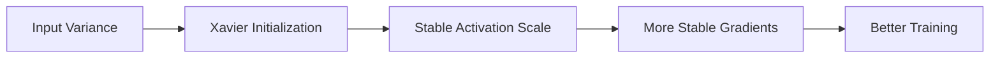

The same principle is used in `Linear`.

---

# 11. Conv2D Bias

If:

```python
bias=True
```

the layer creates:

```python
self.bias = Tensor(np.zeros(out_channels))
```

Therefore:

```text
bias shape = (out_channels,)
```

For 16 filters:

```text
bias shape = (16,)
```

Each output channel gets one bias value.

Conceptually:

```text
output = convolution(input, weight) + bias
```

---

# 12. Conv2D Forward Pass

The implementation is:

```python
def __call__(self, x):
    return conv2d(
        x,
        self.weight,
        self.bias,
        stride=self.stride,
        pad=self.pad
    )
```

The layer itself does not implement the convolution algorithm.

Instead:

```text
Conv2D
  ↓
engine.conv2d()
  ↓
Tensor computation graph
  ↓
Output Tensor
```

### Architecture

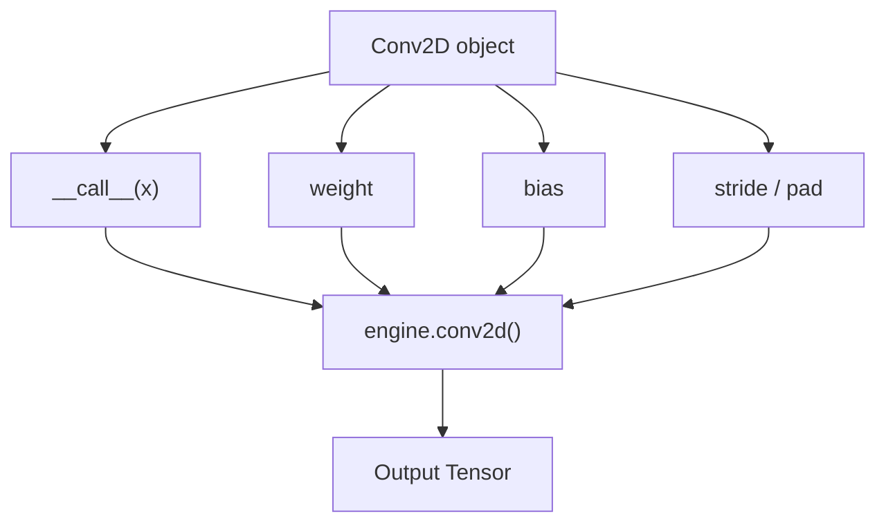

This separation keeps the project modular:

```text
layers.py → what a layer is
engine.py  → how tensor operations work
```

---

# 13. Conv2D Parameters

```python
def parameters(self):
    return [self.weight] + (
        [self.bias] if self.bias is not None else []
    )
```

If bias exists:

```text
[
    weight,
    bias
]
```

If bias is disabled:

```text
[
    weight
]
```

The optimizer can therefore update these tensors.

---

# 14. Conv2D `__repr__`

```python
def __repr__(self):
    return (
        f"Conv2D(
            weight={self.weight.shape},
            stride={self.stride},
            pad={self.pad}
        )"
    )
```

This provides a compact representation useful during debugging.

Example conceptually:

```text
Conv2D(weight=(16, 3, 3, 3), stride=1, pad=1)
```

---

# 15. `MaxPool2D`

## Purpose

`MaxPool2D` performs spatial downsampling.

It reduces the height and width of feature maps while retaining the strongest activation within each pooling window.

Example:

```text
Input:

[1 3]
[2 4]

Max = 4
```

So:

```text
[1 3]       [4]
[2 4]  →
```

---

# 16. Max Pooling Example

For a `2 × 2` pooling window:

```text
Feature map:

[ 1  5  2  4 ]
[ 3  7  1  2 ]
[ 8  0  6  3 ]
[ 2  4  9  1 ]
```

With:

```text
pool_size = 2
stride = 2
```

the windows are:

```text
[1 5]    [2 4]
[3 7]    [1 2]

[8 0]    [6 3]
[2 4]    [9 1]
```

Taking the maximum gives:

```text
[7 4]
[8 9]
```

### Diagram

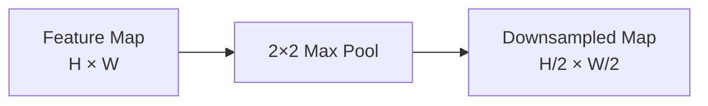

---

# 17. MaxPool2D Constructor

```python
def __init__(self, pool_size=2, stride=None):
    self.pool_size = pool_size
    self.stride = stride if stride is not None else pool_size
```

If:

```python
MaxPool2D(pool_size=2)
```

then:

```text
pool_size = 2
stride = 2
```

If the user explicitly provides:

```python
MaxPool2D(pool_size=2, stride=1)
```

then:

```text
pool_size = 2
stride = 1
```

---

# 18. Why MaxPool2D Has No Parameters

Max pooling performs a fixed mathematical operation:

```text
output = maximum(window)
```

There is nothing to learn.

Therefore:

```python
def parameters(self):
    return []
```

### Comparison

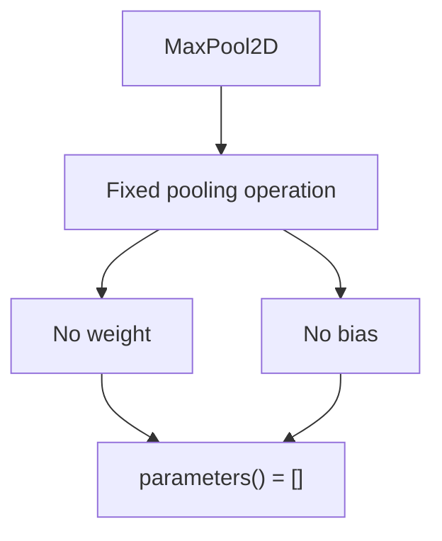

---

# 19. MaxPool2D Forward Pass

```python
def __call__(self, x):
    return max_pool2d(
        x,
        pool_size=self.pool_size,
        stride=self.stride
    )
```

Again, the layer delegates the actual computation to `engine.py`.

```text
MaxPool2D
    ↓
engine.max_pool2d()
    ↓
Output Tensor
```

---

# 20. `Linear`

## Purpose

`Linear` is a fully connected layer.

It performs:

\[
Y = XW + b
\]

where:

- `X` = input
- `W` = learnable weight matrix
- `b` = learnable bias
- `Y` = output

---

# 21. Linear Tensor Shapes

The implementation creates:

```python
w_data = np.random.uniform(
    -limit,
    limit,
    size=(in_features, out_features)
)
```

Therefore:

```text
W shape = (in_features, out_features)
```

Example:

```python
Linear(128, 10)
```

has:

```text
W = (128, 10)
b = (10,)
```

If the input is:

```text
X = (32, 128)
```

then:

```text
X @ W

(32, 128) @ (128, 10)

= (32, 10)
```

### Diagram

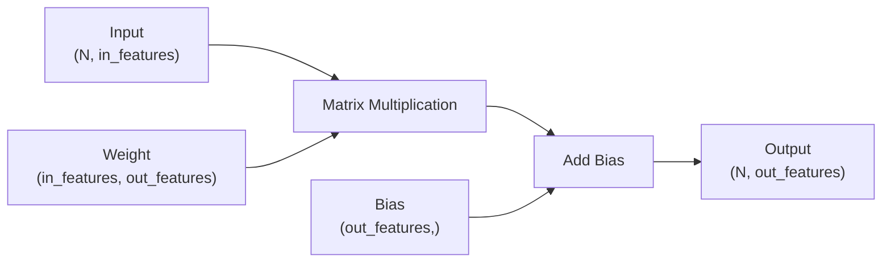

---

# 22. Linear Forward Pass

The code:

```python
out = x.matmul(self.weight)

if self.bias is not None:
    out = out + self.bias

return out
```

Mathematically:

\[
Y = XW + b
\]

This is the standard affine transformation used in neural networks.

---

# 23. Linear Initialization

The layer calculates:

```python
limit = np.sqrt(
    6.0 / (in_features + out_features)
)
```

Then:

```python
np.random.uniform(
    -limit,
    limit,
    size=(in_features, out_features)
)
```

This is Xavier/Glorot-style uniform initialization.

### Why?

The objective is to avoid starting training with weights that are too large or too small.

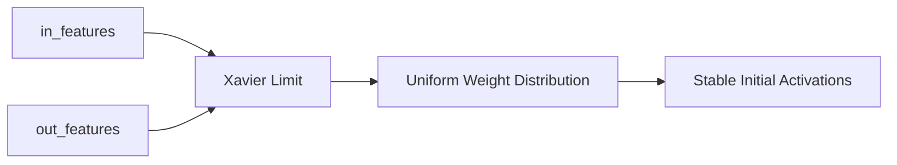

---

# 24. Linear Parameters

If bias is enabled:

```python
parameters()
```

returns:

```text
[
    weight,
    bias
]
```

If bias is disabled:

```text
[
    weight
]
```

This makes `Linear` compatible with the optimizer.

---

# 25. Flatten

## Purpose

`Flatten` converts a multi-dimensional feature map into a 2D matrix suitable for a fully connected layer.

CNN feature maps commonly have:

```text
(N, C, H, W)
```

while `Linear` expects:

```text
(N, features)
```

So:

```text
(N, C, H, W)
        ↓
(N, C × H × W)
```

---

# 26. Flatten Example

Suppose the convolutional network produces:

```text
(N, 16, 7, 7)
```

Then:

```text
features = 16 × 7 × 7
         = 784
```

The flattened output becomes:

```text
(N, 784)
```

### Diagram


---

# 27. Flatten Implementation

```python
def __call__(self, x):
    n = x.shape[0]
    flat_size = int(np.prod(x.shape[1:]))
    return x.reshape(n, flat_size)
```

### Step 1 — preserve batch size

```python
n = x.shape[0]
```

If:

```text
x.shape = (32, 16, 7, 7)
```

then:

```text
n = 32
```

The batch dimension is preserved.

---

## Step 2 — calculate feature count

```python
flat_size = int(np.prod(x.shape[1:]))
```

For:

```text
(32, 16, 7, 7)
```

we calculate:

```text
16 × 7 × 7 = 784
```

---

## Step 3 — reshape

```python
x.reshape(n, flat_size)
```

Therefore:

```text
(32, 16, 7, 7)
        ↓
(32, 784)
```

---

# 28. Why Does Flatten Preserve the Batch Dimension?

The first dimension represents independent samples.

For:

```text
(N, C, H, W)
```

we do **not** flatten everything into:

```text
(N × C × H × W)
```

Instead:

```text
N
↓
preserved

C × H × W
↓
flattened
```

### Correct

```text
(N, C, H, W)
       ↓
(N, C×H×W)
```

### Incorrect for a normal batch-based classifier

```text
(N, C, H, W)
       ↓
(N×C×H×W)
```

---

# 29. Flatten Has No Learnable Parameters

Flatten only changes the tensor shape.

It does not perform a learned transformation.

Therefore:

```python
def parameters(self):
    return []
```

---

# 30. Complete CNN Data Flow

A typical CNN using these layers can be represented as:

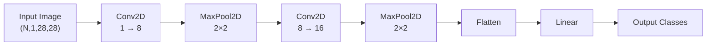

For an MNIST-style network:

```text
Input
(N, 1, 28, 28)

       ↓ Conv2D

(N, 8, 28, 28)        # if padding preserves size

       ↓ MaxPool2D

(N, 8, 14, 14)

       ↓ Conv2D

(N, 16, 14, 14)

       ↓ MaxPool2D

(N, 16, 7, 7)

       ↓ Flatten

(N, 784)

       ↓ Linear

(N, 10)
```

---

# 31. Stateful Parameter Flow

The important distinction is that only some layers own trainable tensors.

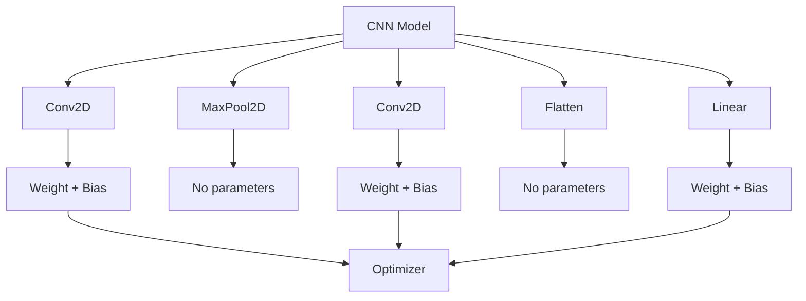

---

# 32. Layer Comparison

| Layer       | Main operation               | Learnable? | Main parameters |
| ----------- | ---------------------------- | ---------: | --------------- |
| `Conv2D`    | Spatial convolution          |        Yes | Weight, bias    |
| `MaxPool2D` | Maximum downsampling         |         No | None            |
| `Linear`    | Matrix multiplication + bias |        Yes | Weight, bias    |
| `Flatten`   | Reshape                      |         No | None            |

---

# 33. Parameter Count

Understanding parameter count is important when analyzing model capacity.

## Conv2D

For:

```text
in_channels = C_in
out_channels = C_out
kernel = K × K
```

weights:

\[
C*{out} \times C*{in} \times K \times K
\]

If bias is enabled:

\[
+C\_{out}
\]

Therefore:

\[
\boxed{
C*{out}(C*{in}K^2 + 1)
}
\]

---

## Example

```text
Conv2D(3, 16, 3)
```

Weight parameters:

\[
16 \times 3 \times 3 \times 3 = 432
\]

Bias parameters:

\[
16
\]

Total:

\[
448
\]

---

# 34. Linear Parameter Count

For:

```text
Linear(in_features, out_features)
```

weights:

\[
in_features \times out_features
\]

bias:

\[
out_features
\]

Total:

\[
\boxed{
in_features \times out_features + out_features
}
\]

when bias is enabled.

---

## Example

```text
Linear(784, 10)
```

Weights:

\[
784 \times 10 = 7840
\]

Bias:

\[
10
\]

Total:

\[
7850
\]

---

# 35. Why Convolution Is Parameter-Efficient

Compare:

```text
28 × 28 image
```

with a fully connected layer.

A convolution filter uses a small local kernel:

```text
3 × 3
```

and reuses the same weights across the image.

This is called **weight sharing**.

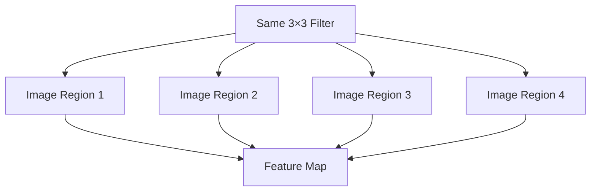

This gives CNNs a strong inductive bias for spatial data.

---

# 36. Why `MaxPool2D` Is Useful

Max pooling provides:

### 1. Downsampling

Reduces spatial dimensions.

### 2. Computational savings

Later layers operate on smaller feature maps.

### 3. Local translation tolerance

Small shifts in a feature may still preserve a strong activation.

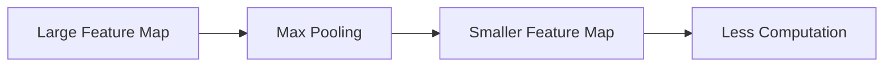

---

# 37. Why `Flatten` Is Needed

Convolutional layers understand spatial structure.

Linear layers operate on feature vectors.

Flatten acts as the bridge:

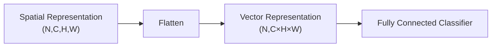

---

# 38. Why `Layer` Has a Common Interface

Every layer can expose:

```python
layer(x)
layer.parameters()
layer.zero_grad()
```

This makes it possible to construct models from heterogeneous components.

For example:

```python
layers = [
    Conv2D(...),
    MaxPool2D(...),
    Conv2D(...),
    Flatten(),
    Linear(...)
]
```

The model can treat every object as a `Layer`.

---

# 39. Object-Oriented Design

The architecture follows:

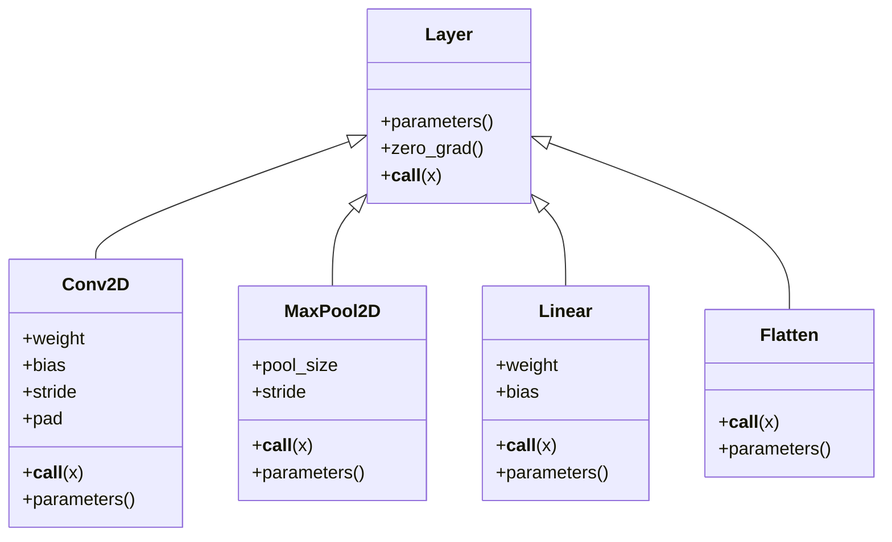

---

# 40. How the Layers Connect to Autograd

The parameters are `Tensor` objects.

For example:

```python
self.weight = Tensor(w_data)
```

When a layer performs operations using these tensors, the resulting computation participates in the autograd graph.

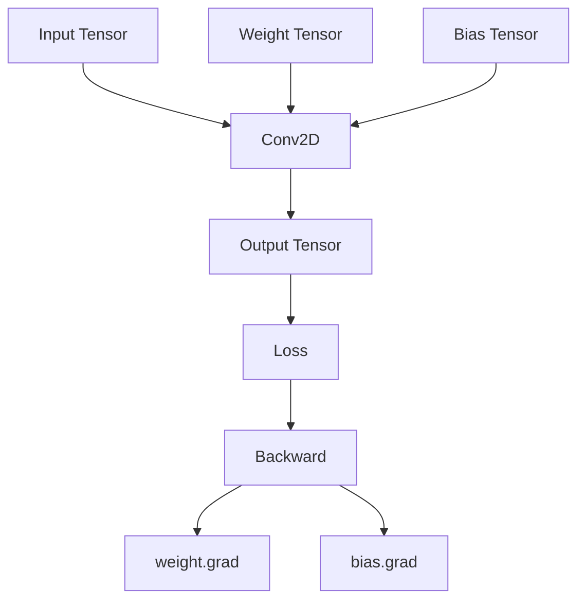

This is the key reason the layers are **stateful**: they retain the tensors whose gradients must eventually be optimized.

---

# 41. Training Lifecycle

The complete conceptual lifecycle is:

```mermaid
flowchart TD
    A["Initialize Layer"] --> B["Initialize Weights"]
    B --> C["Forward Pass"]
    C --> D["Build Computation Graph"]
    D --> E["Calculate Loss"]
    E --> F["Backward Pass"]
    F --> G["Calculate Parameter Gradients"]
    G --> H["Optimizer Updates Parameters"]
    H --> I["Zero Gradients"]
    I --> C
```

---

# 42. `layers.py` Responsibility

A clean architecture separates responsibilities:

```text
                    CNN Foundation
                         │
        ┌────────────────┼────────────────┐
        │                │                │
    engine.py        layers.py        optim.py
        │                │                │
Tensor/autograd     Stateful layers   Parameter updates
operations
```

### `engine.py`

Responsible for:

- Tensor representation
- autograd
- primitive operations
- convolution
- pooling
- reshape/matmul operations

### `layers.py`

Responsible for:

- reusable layer objects
- parameter ownership
- layer configuration
- forwarding calls to engine operations

### `optim.py`

Responsible for:

- updating learnable parameters

---

# 43. Practical Example

A simple CNN can conceptually be assembled as:

```python
conv1 = Conv2D(
    in_channels=1,
    out_channels=8,
    kernel_size=3,
    pad=1
)

pool = MaxPool2D(pool_size=2)

conv2 = Conv2D(
    in_channels=8,
    out_channels=16,
    kernel_size=3,
    pad=1
)

flatten = Flatten()

fc = Linear(
    in_features=16 * 7 * 7,
    out_features=10
)
```

Forward flow:

```python
x = conv1(x)
x = pool(x)
x = conv2(x)
x = pool(x)
x = flatten(x)
x = fc(x)
```

### Graph

```mermaid
flowchart LR
    A["MNIST<br/>(N,1,28,28)"]
    --> B["Conv2D<br/>1→8"]
    --> C["MaxPool<br/>2×2"]
    --> D["Conv2D<br/>8→16"]
    --> E["MaxPool<br/>2×2"]
    --> F["Flatten<br/>→784"]
    --> G["Linear<br/>784→10"]
    --> H["Logits<br/>(N,10)"]
```

---

# 44. Important Design Patterns in `layers.py`

## Pattern 1 — Encapsulation

A layer stores its own parameters.

```text
Conv2D
 ├── weight
 ├── bias
 ├── stride
 └── pad
```

---

## Pattern 2 — Delegation

The layer delegates low-level tensor computation to `engine.py`.

```text
Layer
  ↓
Functional operation
  ↓
Tensor/autograd
```

---

## Pattern 3 — Polymorphism

Different layers expose the same interface:

```python
layer(x)
layer.parameters()
layer.zero_grad()
```

but perform different computations.

---

## Pattern 4 — Parameter discovery

The optimizer does not need to know whether a parameter belongs to a convolution or linear layer.

It only needs:

```python
parameters()
```

---

# 45. Summary

`layers.py` is the bridge between the project's **low-level autograd engine** and a **usable neural-network architecture**.

The four major layers have distinct responsibilities:

```text
Conv2D
→ learns spatial features

MaxPool2D
→ reduces spatial dimensions

Flatten
→ converts feature maps into vectors

Linear
→ performs final feature transformation/classification
```

The most important architectural idea is:

```mermaid
flowchart LR
    A["Tensor Operations<br/>engine.py"]
    --> B["Stateful Layers<br/>layers.py"]
    --> C["Model Architecture<br/>model.py"]
    --> D["Training<br/>loss + optimizer"]
```

> **Conv2D (Learns spatial features)**
> Imagine looking at a photo of a cat. Spatial features are patterns bound to specific locations and shapes—like sharp edges, textures, curved outlines, or eyes. Conv2D slides tiny filter boxes (kernels) across the image grid to detect these local visual cues while preserving _where_ they are located relative to each other (top, left, bottom, etc.).

> **MaxPool2D (Reduces spatial dimensions)**
> Instead of keeping every pixel detail, MaxPool2D zooms out by dividing the image into small sub-grids (like 2x2 blocks) and keeping only the strongest signal (maximum value) from each block. This shrinks the width and height of the feature map, cutting down computation while making the network less sensitive to minor shifts or translations in the image.

> **Flatten (Converts feature maps into vectors)**
> A convolutional layer outputs data as a 3D block (Height × Width × Channels/Features). Deep learning decision-layers (like standard neural networks) expect inputs as a simple 1D line of numbers. Flatten takes that multi-layered grid and unrolls all its values sequentially into a single continuous list, like taking a multi-page grid and laying every number out end-to-end.

> **Linear (Performs final feature transformation/classification)**
> Once the visual cues are unrolled into a single list, the Linear layer combines all these detected clues together to make a final decision. It weighs every extracted pattern—e.g., "if point A has an eye texture AND point B has a pointy ear feature"—and outputs a score or probability for each class (e.g., Cat, Dog, or Car).

### Key takeaway

> **`engine.py` knows how to perform tensor operations; `layers.py` packages those operations into reusable stateful components with learnable parameters.**

This separation is fundamental to understanding how modern deep-learning frameworks organize neural-network code.
