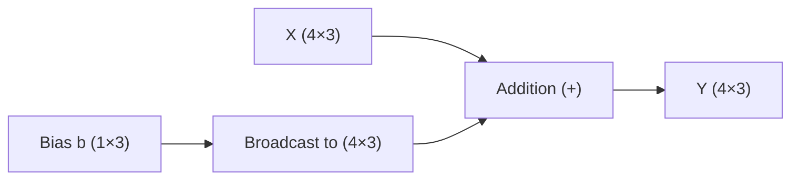
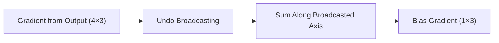
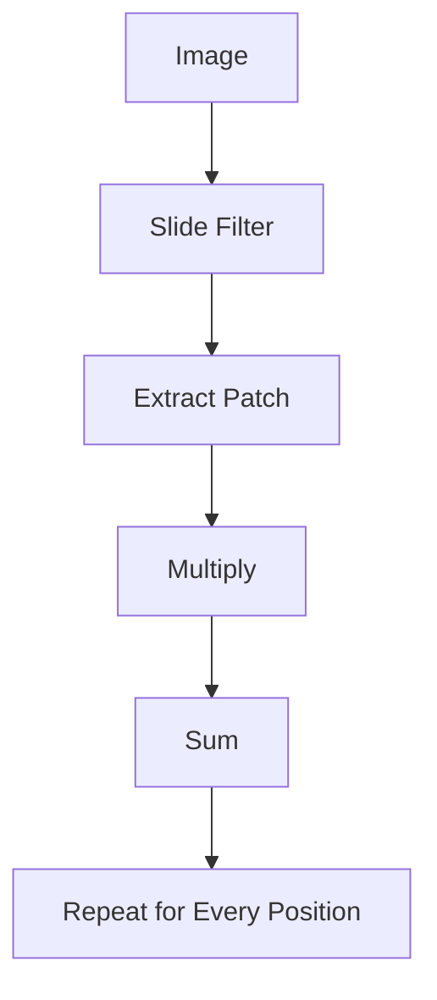
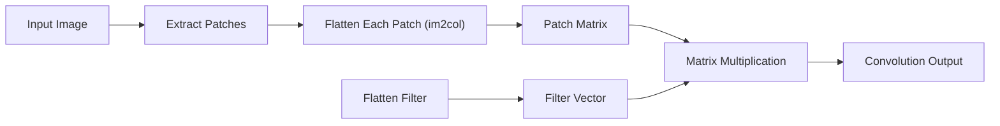
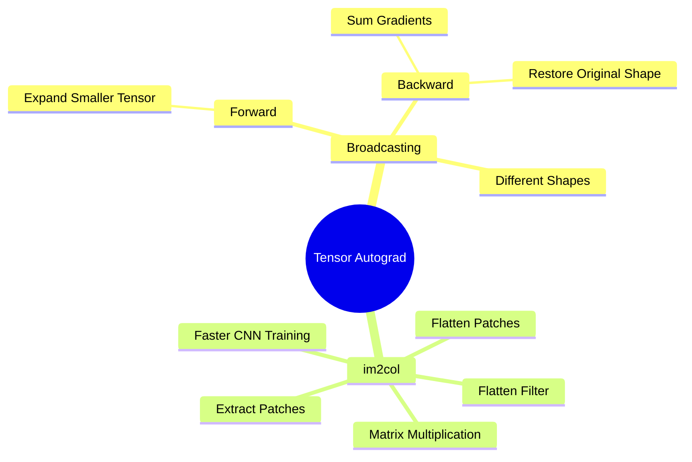

# Tensor Autograd Notes

## 1. Broadcasting-Aware Gradients

### What is Broadcasting?

**Broadcasting** is a NumPy feature that allows arithmetic operations between arrays of different shapes **without actually copying data**.

### Example

```python
X.shape = (4, 3)
b.shape = (1, 3)

Y = X + b
```

### Input Tensor

```text
X

1 2 3
4 5 6
7 8 9
1 1 1
```

### Bias Tensor

```text
b

10 20 30
```

Although `b` has only one row, NumPy automatically treats it as

```text
10 20 30
10 20 30
10 20 30
10 20 30
```

> **Important:** NumPy does **not** create these extra rows in memory. It only behaves **as if** they exist.

---

## Broadcasting Visualization



---

## Forward Pass

### Before Addition

```text
X

1 2 3
4 5 6
```

```text
Bias

10 20 30
```

↓

### Output

```text
11 22 33
14 25 36
```

The bias is added to **every row**.

---

## Backward Pass

During backpropagation, suppose the incoming gradient is

```text
1 1 1
1 1 1
```

---

### Gradient of X

Each element in `X` contributes only once.

```text
∂L/∂X

1 1 1
1 1 1
```

Nothing special happens.

---

### Gradient of Bias

The bias was reused for **both rows**.

Therefore, gradients from every row must be **summed together**.

```text
Column 1

1 + 1 = 2
```

```text
Column 2

1 + 1 = 2
```

```text
Column 3

1 + 1 = 2
```

Final bias gradient:

```text
∂L/∂b

2 2 2
```

---

## Why Do We Sum?

The same bias value was used multiple times during the forward pass.

Therefore, during the backward pass, all gradient contributions must be accumulated.

---

## Backward Flow



---

## Forward vs Backward

| Forward Pass                      | Backward Pass                             |
| --------------------------------- | ----------------------------------------- |
| NumPy expands the smaller tensor. | Sum gradients back to the original shape. |
| Shape becomes larger temporarily. | Shape returns to the original tensor.     |

---

## Key Takeaway

> **Forward:** Broadcast the smaller tensor.

> **Backward:** Undo the broadcast by summing gradients along the broadcasted dimensions.

Without this step, gradients would have incorrect shapes and the neural network would learn incorrect parameter updates.

---

# 2. im2col-Based Convolution

## What is Convolution?

Convolution is the fundamental operation used in **Convolutional Neural Networks (CNNs)**.

Suppose we have a **3×3 image**.

```text
1 2 3
4 5 6
7 8 9
```

and a **2×2 filter**.

```text
1 0
0 1
```

The traditional algorithm slides the filter across the image one position at a time.

---

## Traditional Convolution



This requires many nested loops.

Although correct, it becomes slow for large images.

---

# The Smarter Idea: im2col

Instead of repeatedly sliding the filter, we convert every image patch into a row of a matrix.

---

## Original Image

```text
1 2 3
4 5 6
7 8 9
```

---

## Extract Every 2×2 Patch

```text
Patch 1

1 2
4 5
```

```text
Patch 2

2 3
5 6
```

```text
Patch 3

4 5
7 8
```

```text
Patch 4

5 6
8 9
```

---

## Flatten Each Patch

Each 2×2 patch becomes one row.

```text
1 2 4 5
2 3 5 6
4 5 7 8
5 6 8 9
```

This matrix is called the **im2col matrix**.

---

## Flatten the Filter

The filter

```text
1 0
0 1
```

becomes

```text
1
0
0
1
```

---

## Matrix Multiplication

Now convolution becomes

```text
Patch Matrix

×

Filter Vector

=

Output
```

Instead of hundreds of tiny multiplications, we perform **one large matrix multiplication**.

---

## im2col Workflow



---

## Why is im2col Faster?

Modern CPUs and GPUs are highly optimized for **matrix multiplication** using libraries such as:

- BLAS
- OpenBLAS
- Intel MKL
- cuBLAS (GPU)

Instead of writing slow nested loops, deep learning frameworks convert convolution into a matrix multiplication and let these optimized libraries perform the heavy computation.

---

## Traditional vs im2col

| Traditional Convolution | im2col Convolution            |
| ----------------------- | ----------------------------- |
| Many nested loops       | Single matrix multiplication  |
| Slower                  | Much faster                   |
| Harder to optimize      | Uses optimized BLAS libraries |
| Simple concept          | Efficient implementation      |

---

## Why Deep Learning Frameworks Use im2col

Libraries like **PyTorch**, **TensorFlow**, and **Caffe** internally transform convolution into matrix multiplication because optimized linear algebra libraries can perform these operations much faster than manually iterating through image pixels.

---

# Summary



## Key Points

### Broadcasting

- Allows operations on tensors with different shapes.
- NumPy **pretends** to expand the smaller tensor.
- During backpropagation, gradients are summed back to the original shape.

### im2col

- Converts image patches into rows of a matrix.
- Converts convolution into matrix multiplication.
- Uses highly optimized linear algebra libraries.
- Makes CNNs significantly faster.
