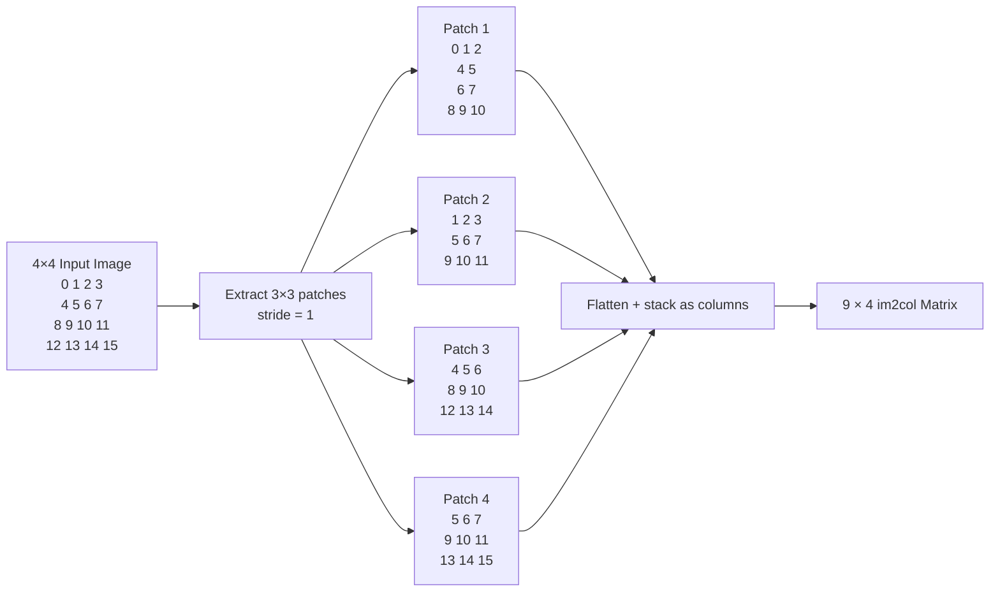

# Understanding `im2col`: Step-by-Step Derivation

> `im2col` does not perform convolution itself. It rearranges every local image patch into a column so that convolution can later be performed using ordinary matrix multiplication.

Let's derive your exact output step by step.

---

## 1. Input Setup

You have one image with the following dimensions:

- Batch size: $N = 1$
- Channels: $C = 1$
- Height: $H = 4$
- Width: $W = 4$

So the input tensor is:
$$X \in \mathbb{R}^{1 \times 1 \times 4 \times 4}$$

Your image values are:

$$
X =
\begin{bmatrix}
0 & 1 & 2 & 3 \\
4 & 5 & 6 & 7 \\
8 & 9 & 10 & 11 \\
12 & 13 & 14 & 15
\end{bmatrix}
$$

You use a kernel with:

- Kernel height/width: $k_h = 3,\; k_w = 3$
- Stride: $S = 1$
- Padding: $P = 0$

---

## 2. Output Size Calculation

Before extracting patches, we calculate how many positions the $3 \times 3$ kernel can occupy.

For height:
$$H_{\text{out}} = \left\lfloor \frac{H + 2P - k_h}{S} \right\rfloor + 1$$
Substituting values:
$$H_{\text{out}} = \left\lfloor \frac{4 + 0 - 3}{1} \right\rfloor + 1 = 2$$

Similarly for width:
$$W_{\text{out}} = \left\lfloor \frac{4 + 0 - 3}{1} \right\rfloor + 1 = 2$$

Therefore:
$$H_{\text{out}} \times W_{\text{out}} = 2 \times 2 = 4$$
So there are **4 possible $3 \times 3$ patches**.

---

## 3. Extracting & Visualizing the Four Patches

The kernel starts at the top-left and moves one pixel at a time (stride=1).

### Position 1 — Top-Left

```
0  1  2
4  5  6
8  9 10
```

Flattened: $\begin{bmatrix} 0 & 1 & 2 & 4 & 5 & 6 & 8 & 9 & 10 \end{bmatrix}^\top$

### Position 2 — Move Right by Stride 1

```
1  2  3
5  6  7
9 10 11
```

Flattened: $\begin{bmatrix} 1 & 2 & 3 & 5 & 6 & 7 & 9 & 10 & 11 \end{bmatrix}^\top$

### Position 3 — Move Down

```
4  5  6
8  9 10
12 13 14
```

Flattened: $\begin{bmatrix} 4 & 5 & 6 & 8 & 9 & 10 & 12 & 13 & 14 \end{bmatrix}^\top$

### Position 4 — Bottom-Right

```
5  6  7
9 10 11
13 14 15
```

Flattened: $\begin{bmatrix} 5 & 6 & 7 & 9 & 10 & 11 & 13 & 14 & 15 \end{bmatrix}^\top$

---

## 4. Stacking Patches as Columns

This is the crucial operation. We have four column vectors:

$$
P_1 = \begin{bmatrix} 0 \\ 1 \\ 2 \\ 4 \\ 5 \\ 6 \\ 8 \\ 9 \\ 10 \end{bmatrix},\quad
P_2 = \begin{bmatrix} 1 \\ 2 \\ 3 \\ 5 \\ 6 \\ 7 \\ 9 \\ 10 \\ 11 \end{bmatrix},\quad
P_3 = \begin{bmatrix} 4 \\ 5 \\ 6 \\ 8 \\ 9 \\ 10 \\ 12 \\ 13 \\ 14 \end{bmatrix},\quad
P_4 = \begin{bmatrix} 5 \\ 6 \\ 7 \\ 9 \\ 10 \\ 11 \\ 13 \\ 14 \\ 15 \end{bmatrix}
$$

`im2col` constructs:
$$\boxed{\text{cols} = \left[ P_1 \;\; P_2 \;\; P_3 \;\; P_4 \right]}$$

Therefore:

$$
\text{cols} =
\begin{bmatrix}
0 & 1 & 4 & 5 \\
1 & 2 & 5 & 6 \\
2 & 3 & 6 & 7 \\
4 & 5 & 8 & 9 \\
5 & 6 & 9 & 10 \\
6 & 7 & 10 & 11 \\
8 & 9 & 12 & 13 \\
9 & 10 & 13 & 14 \\
10 & 11 & 14 & 15
\end{bmatrix}
$$

And that's **exactly your output**.

---

## 5. Why Is It $(9, 4)$?

Your kernel contains $C \times k_h \times k_w$ elements. Here:
$$1 \times 3 \times 3 = 9$$
Therefore every extracted patch becomes a vector of length **9**.

And there are $H_{\text{out}} \times W_{\text{out}} = 2 \times 2 = 4$ patches.

Hence:
$$\boxed{\text{cols.shape} = (9, 4)}$$

More generally:
$$\boxed{\text{im2col shape} = (C k_h k_w,\; N H_{\text{out}} W_{\text{out}})}$$
For your case: $(1 \times 3 \times 3,\; 1 \times 2 \times 2) \rightarrow \boxed{(9, 4)}$

---

## 6. What Does Each Row Mean?

Look at your output matrix:

```text
[[ 0.  1.  4.  5.]
 [ 1.  2.  5.  6.]
 [ 2.  3.  6.  7.]
 [ 4.  5.  8.  9.]
 [ 5.  6.  9. 10.]
 [ 6.  7. 10. 11.]
 [ 8.  9. 12. 13.]
 [ 9. 10. 13. 14.]
 [10. 11. 14. 15.]]
```

- Each **column** = one $3 \times 3$ patch.
- Each **row** = the same relative position inside all patches.

| Row Index | Relative Position | Values across Patches (P1, P2, P3, P4) |
| :-------: | :---------------- | :------------------------------------- |
|     0     | Top-left          | `0, 1, 4, 5`                           |
|     1     | Top-middle        | `1, 2, 5, 6`                           |
|     2     | Top-right         | `2, 3, 6, 7`                           |
|     3     | Middle-left       | `4, 5, 8, 9`                           |
|     4     | Center            | `5, 6, 9, 10`                          |
|     5     | Middle-right      | `6, 7, 10, 11`                         |
|     6     | Bottom-left       | `8, 9, 12, 13`                         |
|     7     | Bottom-middle     | `9, 10, 13, 14`                        |
|     8     | Bottom-right      | `10, 11, 14, 15`                       |

This is why the matrix looks exactly this way.

---

## 7. Mermaid Visualization: The Transformation Flow



---

## 8. Why Does Convolution Need This?

This is where `im2col` becomes really powerful.

Suppose your convolution has **one** $3 \times 3$ filter:

$$

K =
\begin{bmatrix}
k_1 & k_2 & k_3 \\
k_4 & k_5 & k_6 \\
k_7 & k_8 & k_9
\end{bmatrix}


$$

Flatten the kernel in the same order as the image patches:

$$

K\_{\text{flat}} =
\begin{bmatrix}
k_1 \\
k_2 \\
k_3 \\
k_4 \\
k_5 \\
k_6 \\
k_7 \\
k_8 \\
k_9
\end{bmatrix}


$$

Notice something important:

> The kernel must be flattened using the **same ordering** used by `im2col`.

Our `im2col` matrix is:

$$

\text{cols} =
\begin{bmatrix}
0 & 1 & 4 & 5 \\
1 & 2 & 5 & 6 \\
2 & 3 & 6 & 7 \\
4 & 5 & 8 & 9 \\
5 & 6 & 9 & 10 \\
6 & 7 & 10 & 11 \\
8 & 9 & 12 & 13 \\
9 & 10 & 13 & 14 \\
10 & 11 & 14 & 15
\end{bmatrix}


$$

The shape is:

$$

(9,4)


$$

while the flattened kernel has shape:

$$

(9,1)


$$

For matrix multiplication, we use the transpose:

$$

K\_{\text{flat}}^T


$$

which has shape:

$$

(1,9)


$$

Therefore:

$$

(1,9) \times (9,4)


$$

produces:

$$

(1,4)


$$

---

## 9. Convolution Becomes Matrix Multiplication

The convolution operation can now be written as:

$$

# Y\_{\text{flat}}

K\_{\text{flat}}^T \cdot \text{cols}


$$

Therefore:

$$

\boxed{
(1 \times 9)(9 \times 4)
=
(1 \times 4)
}


$$

This produces the four output positions.

Let's expand it:

$$

Y_1 =
k_1(0)
+k_2(1)
+k_3(2)
+k_4(4)
+k_5(5)
+k_6(6)
+k_7(8)
+k_8(9)
+k_9(10)


$$

This corresponds exactly to:

```text
0  1  2
4  5  6
8  9 10
```

Here is your complete document cleanly formatted in Markdown (`.md`):

---

$$Y_1 = K \odot P_1$$

where $\odot$ represents element-wise multiplication followed by summation.

For the second patch:

$$Y_2 = k_1(1) + k_2(2) + k_3(3) + k_4(5) + k_5(6) + k_6(7) + k_7(9) + k_8(10) + k_9(11)$$

which corresponds to:

```text
1  2  3
5  6  7
9 10 11

```

Similarly:

$$Y_3 = K_{\text{flat}}^T P_3$$

$$Y_4 = K_{\text{flat}}^T P_4$$

Therefore:

$$Y_{\text{flat}} = \begin{bmatrix} Y_1 & Y_2 & Y_3 & Y_4 \end{bmatrix}$$

---

## 10. Visualizing the Complete Operation

The entire convolution can now be understood as:

```text
Input Image
    │
    │  im2col
    ▼
┌─────────────────────┐
│      cols           │
│                     │
│       9 × 4         │
│                     │
│  4 image patches    │
└─────────────────────┘
          │
          │ Matrix Multiplication
          │
          ▼
┌─────────────────────┐
│   Flattened Kernel  │
│                     │
│       1 × 9         │
└─────────────────────┘
          │
          ▼
      1 × 4 Output
          │
          ▼
       Reshape
          │
          ▼
      2 × 2 Feature Map

```

Mathematically:

$$Y = K_{\text{flat}}^T \cdot \text{im2col}(X)$$

---

## 11. Numerical Example

Let's choose a simple kernel:

$$K = \begin{bmatrix} 1 & 0 & 1 \\ 0 & 1 & 0 \\ 1 & 0 & 1 \end{bmatrix}$$

Flatten it:

$$K_{\text{flat}} = \begin{bmatrix} 1 \\ 0 \\ 1 \\ 0 \\ 1 \\ 0 \\ 1 \\ 0 \\ 1 \end{bmatrix}$$

Therefore:

$$K_{\text{flat}}^T = \begin{bmatrix} 1 & 0 & 1 & 0 & 1 & 0 & 1 & 0 & 1 \end{bmatrix}$$

Now multiply:

$$Y_{\text{flat}} = \begin{bmatrix} 1 & 0 & 1 & 0 & 1 & 0 & 1 & 0 & 1 \end{bmatrix} \begin{bmatrix} 0 & 1 & 4 & 5 \\ 1 & 2 & 5 & 6 \\ 2 & 3 & 6 & 7 \\ 4 & 5 & 8 & 9 \\ 5 & 6 & 9 & 10 \\ 6 & 7 & 10 & 11 \\ 8 & 9 & 12 & 13 \\ 9 & 10 & 13 & 14 \\ 10 & 11 & 14 & 15 \end{bmatrix}$$

For the first output:

$$Y_1 = 0 + 2 + 5 + 8 + 10 = 25$$

For the second:

$$Y_2 = 1 + 3 + 6 + 9 + 11 = 30$$

For the third:

$$Y_3 = 4 + 6 + 9 + 12 + 14 = 45$$

For the fourth:

$$Y_4 = 5 + 7 + 10 + 13 + 15 = 50$$

Therefore:

$$Y_{\text{flat}} = \begin{bmatrix} 25 & 30 & 45 & 50 \end{bmatrix}$$

---

## 12. Reshaping the Output

The convolution output has:

$$H_{\text{out}} = 2 \quad \text{and} \quad W_{\text{out}} = 2$$

So we reshape:

$$\begin{bmatrix} 25 & 30 & 45 & 50 \end{bmatrix} \to \begin{bmatrix} 25 & 30 \\ 45 & 50 \end{bmatrix}$$

Therefore the final feature map is:

```text
25  30
45  50

```

The complete transformation is:

$$4 \times 4 \to 9 \times 4 \to 1 \times 4 \to 2 \times 2$$

---

## 13. The Important Connection

This gives us a very useful mental model:

```text
                 im2col
                   │
                   ▼
Input ───────► Patch Matrix
                 (9 × 4)
                   │
                   │ ×
                   ▼
             Kernel Matrix
                 (1 × 9)
                   │
                   ▼
             Output Matrix
                 (1 × 4)
                   │
                reshape
                   ▼
             Feature Map
                 (2 × 2)

```

Or mathematically:

$$X \xrightarrow{\text{im2col}} \text{cols} \xrightarrow{\times K^T} Y_{\text{flat}} \xrightarrow{\text{reshape}} Y$$

---

## 14. What Happens With Multiple Filters?

Real CNNs normally have more than one filter. Suppose we have $C_{\text{out}} = 3$ filters. Each filter has shape $1 \times 3 \times 3$.

After flattening:

$$W_{\text{flat}} \in \mathbb{R}^{3 \times 9}$$

For example:

$$W_{\text{flat}} = \begin{bmatrix} w_{11} & w_{12} & \cdots & w_{19} \\ w_{21} & w_{22} & \cdots & w_{29} \\ w_{31} & w_{32} & \cdots & w_{39} \end{bmatrix}$$

The `im2col` matrix is still:

$$\text{cols} \in \mathbb{R}^{9 \times 4}$$

Now, $W_{\text{flat}} \cdot \text{cols}$ has shape $(3,9) \times (9,4) = (3,4)$.

Therefore:

$$Y_{\text{flat}} \in \mathbb{R}^{3 \times 4}$$

Each row corresponds to one filter:

```text
              Patch 1  Patch 2  Patch 3  Patch 4
Filter 1  →      y11      y12      y13      y14
Filter 2  →      y21      y22      y23      y24
Filter 3  →      y31      y32      y33      y34

```

After reshaping:

$$(3,4) \to (3,2,2)$$

So the final output is:

$$Y \in \mathbb{R}^{3 \times 2 \times 2}$$

This is exactly what a convolution layer with **3 output channels** should produce.

---

## 15. General Case

For a general input $X \in \mathbb{R}^{N \times C \times H \times W}$ and convolution parameters:

- $C_{\text{out}}$ output channels
- $k_h \times k_w$ kernel
- Stride $S$
- Padding $P$

The output dimensions are:

$$H_{\text{out}} = \left\lfloor \frac{H + 2P - k_h}{S} \right\rfloor + 1, \quad W_{\text{out}} = \left\lfloor \frac{W + 2P - k_w}{S} \right\rfloor + 1$$

`im2col` produces:

$$\text{cols} \in \mathbb{R}^{(C \cdot k_h \cdot k_w) \times (N \cdot H_{\text{out}} \cdot W_{\text{out}})}$$

The weights are reshaped from $W \in \mathbb{R}^{C_{\text{out}} \times C \times k_h \times k_w}$ to:

$$W_{\text{flat}} \in \mathbb{R}^{C_{\text{out}} \times (C \cdot k_h \cdot k_w)}$$

Then $W_{\text{flat}} \cdot \text{cols}$ gives:

$$Y_{\text{flat}} \in \mathbb{R}^{C_{\text{out}} \times (N \cdot H_{\text{out}} \cdot W_{\text{out}})}$$

Finally, reshape to $(N, C_{\text{out}}, H_{\text{out}}, W_{\text{out}})$.

---

## 16. Why im2col Is Useful

Without `im2col`, convolution requires repeatedly performing:

```text
Take patch
    ↓
Multiply with kernel
    ↓
Sum
    ↓
Move kernel
    ↓
Take next patch
    ↓
Repeat

```

With `im2col`:

```text
Extract ALL patches
        ↓
Put patches into matrix
        ↓
       GEMM (Matrix Multiplication)
        ↓
     Reshape

```

The key advantage is that highly optimized **matrix multiplication (GEMM)** implementations can be used. Modern CPUs and GPUs are extremely efficient at matrix multiplication.

So `im2col` converts **Convolution** into **Matrix Multiplication**.

---

## 17. im2col Does NOT Perform Convolution

This distinction is extremely important. `im2col` only performs:

$$\text{Input Tensor} \to \text{Patch Matrix}$$

It does **not** know about the filter weights. For example:

```python
cols = _im2col(
    img,
    kh=3,
    kw=3,
    stride=1,
    pad=0
)

```

produces the patch matrix. The kernel is applied later:

```python
output = weights @ cols

```

Conceptually:

```text
                 ┌──────────────┐
                 │   Input X    │
                 └──────┬───────┘
                        │
                     im2col
                        │
                        ▼
                 ┌──────────────┐
                 │     cols     │
                 └──────┬───────┘
                        │
                        │
                 ┌──────▼───────┐
                 │   weights    │
                 └──────┬───────┘
                        │
                     matrix
                  multiplication
                        │
                        ▼
                 ┌──────────────┐
                 │    output    │
                 └──────────────┘

```

---

## 18. Connecting This to Your CNN Implementation

In your CNN implementation, you have something conceptually similar to:

```python
cols = _im2col(
    x,
    kh=kh,
    kw=kw,
    stride=stride,
    pad=pad
)

```

The important question is: **What does $x$ look like here?**

Your input has the shape $(N, C, H, W)$. For example, $(2, 2, 6, 6)$ means:

- $N = 2 \implies 2\text{ images}$
- $C = 2 \implies 2\text{ input channels}$
- $H = 6 \implies \text{height } 6$
- $W = 6 \implies \text{width } 6$

If your kernel is $3 \times 3$, then each patch contains $C \times 3 \times 3 = 2 \times 3 \times 3 = 18$ values.

Therefore, each column of `im2col` contains **18 values**.

| Aspect             | Simple Example                        | Your CNN Example                       |
| ------------------ | ------------------------------------- | -------------------------------------- |
| **Input Channels** | 1 channel                             | 2 channels                             |
| **Kernel Size**    | $3 \times 3$                          | $3 \times 3$                           |
| **Patch Size**     | $1 \times 3 \times 3 = 9$             | $2 \times 3 \times 3 = 18$             |
| **`cols` Shape**   | $9 \times \text{number\_of\_patches}$ | $18 \times \text{number\_of\_patches}$ |

---

## 19. Example With Your CNN Dimensions

Suppose:

```python
x.shape = (2, 2, 6, 6)
kernel = (3, 3)
stride = 1
padding = 0

```

Then:

$$H_{\text{out}} = \frac{6 - 3}{1} + 1 = 4 \quad \text{and} \quad W_{\text{out}} = \frac{6 - 3}{1} + 1 = 4$$

Therefore each image has $4 \times 4 = 16$ spatial positions.

- There are $N = 2$ images: $2 \times 16 = 32$ total patches.
- Each patch contains: $C \times k_h \times k_w = 2 \times 3 \times 3 = 18$ values.

Therefore:

$$\text{cols.shape} = (18, 32)$$

---

## 20. Connecting It to Multiple Output Channels

Your convolution weights have:

```python
w.shape = (3, 2, 3, 3)

```

Meaning $C_{\text{out}} = 3$, $C_{\text{in}} = 2$, $k_h = 3$, and $k_w = 3$. Flattening the weights gives:

$$W_{\text{flat}} \in \mathbb{R}^{3 \times 18}$$

because $2 \times 3 \times 3 = 18$. We already established $\text{cols} \in \mathbb{R}^{18 \times 32}$. Therefore:

$$(3, 18) \times (18, 32) = (3, 32)$$

So matrix multiplication produces $Y_{\text{flat}} \in \mathbb{R}^{3 \times 32}$, which reshapes into:

$$Y \in \mathbb{R}^{2 \times 3 \times 4 \times 4}$$

```text
Input (2, 2, 6, 6)
       │
       │ im2col
       ▼
cols (18, 32)
       │
       │ weights @ cols  ◄── weights (3, 18)
       │
       ▼
output_flat (3, 32)
       │
       │ reshape
       ▼
Output (2, 3, 4, 4)

```

---

## 21. The Entire `Conv2D` Operation

At this point, the complete mathematical picture is:

$$X \xrightarrow{\text{im2col}} \text{cols} \xrightarrow{\times W_{\text{flat}}} Y_{\text{flat}} \xrightarrow{\text{reshape}} Y$$

More explicitly:

$$X \in \mathbb{R}^{N \times C \times H \times W}$$

1. **Step 1 — Extract patches:**

$$\text{cols} \in \mathbb{R}^{(C \cdot k_h \cdot k_w) \times (N \cdot H_{\text{out}} \cdot W_{\text{out}})}$$

2. **Step 2 — Flatten weights:**

$$W_{\text{flat}} \in \mathbb{R}^{C_{\text{out}} \times (C \cdot k_h \cdot k_w)}$$

3. **Step 3 — Matrix multiplication:**

$$Y_{\text{flat}} = W_{\text{flat}} \cdot \text{cols} \in \mathbb{R}^{C_{\text{out}} \times (N \cdot H_{\text{out}} \cdot W_{\text{out}})}$$

4. **Step 4 — Reshape:**

$$Y \in \mathbb{R}^{N \times C_{\text{out}} \times H_{\text{out}} \times W_{\text{out}}}$$

---

## 22. One-Sentence Mental Model

> **`im2col` takes every local convolution window, flattens it, and places it into a column so that all convolution operations can be expressed as one large matrix multiplication.**

Or even shorter:

$$\text{im2col} = \text{local patches} \to \text{columns}$$

$$\text{Convolution} = \text{weights} \times \text{im2col}(\text{input})$$

---

## 23. Final Shape Summary

### Simple Example

| Object                    | Shape                  | Meaning                          |
| ------------------------- | ---------------------- | -------------------------------- |
| **Input**                 | $(1, 1, 4, 4)$         | One $4 \times 4$ grayscale image |
| **Kernel**                | $(1, 1, 3, 3)$         | One $3 \times 3$ filter          |
| **Output Spatial Size**   | $(2, 2)$               | 4 kernel positions               |
| **Flattened Patch**       | $(9, 1)$               | One $3 \times 3$ patch           |
| **`im2col` Matrix**       | $(9, 4)$               | 4 patches                        |
| **Flattened Kernel**      | $(1, 9)$               | One filter                       |
| **Matrix Multiplication** | $(1, 9) \times (9, 4)$ | Convolution step                 |
| **Flat Output**           | $(1, 4)$               | 4 output values                  |
| **Final Output**          | $(1, 1, 2, 2)$         | $2 \times 2$ feature map         |

### Actual CNN Example

| Object                    | Shape                     | Meaning                                                 |
| ------------------------- | ------------------------- | ------------------------------------------------------- |
| **Input**                 | $(2, 2, 6, 6)$            | 2 images, 2 channels, $6 \times 6$ spatial size         |
| **Weights**               | $(3, 2, 3, 3)$            | 3 output filters, 2 input channels, $3 \times 3$ kernel |
| **Output Spatial Size**   | $(4, 4)$                  | Spatial grid for each feature map                       |
| **Values per Patch**      | $18$                      | $2 \times 3 \times 3 = 18$                              |
| **Number of Patches**     | $32$                      | $2 \text{ images} \times 4 \times 4 = 32$               |
| **`im2col` Matrix**       | $(18, 32)$                | All input windows arranged into columns                 |
| **Flattened Weights**     | $(3, 18)$                 | All filters reshaped into 2D                            |
| **Matrix Multiplication** | $(3, 18) \times (18, 32)$ | Matrix multiply filters with image patches              |
| **Flat Output**           | $(3, 32)$                 | Intermediate 2D output matrix                           |
| **Final Output**          | $(2, 3, 4, 4)$            | Batched 3D feature map tensor                           |

### The Core Matrix Multiplication Equation

$$\underbrace{W_{\text{flat}}}_{\left(C_{\text{out}} \times C \cdot k_h \cdot k_w\right)} \times \underbrace{\text{cols}}_{\left(C \cdot k_h \cdot k_w \times N \cdot H_{\text{out}} \cdot W_{\text{out}}\right)} = \underbrace{Y_{\text{flat}}}_{\left(C_{\text{out}} \times N \cdot H_{\text{out}} \cdot W_{\text{out}}\right)}$$

$$
$$
